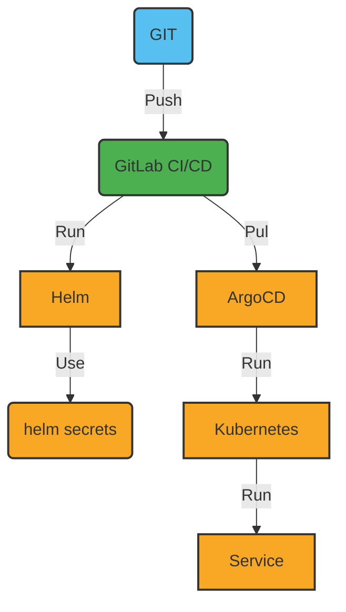

{/* Generated by scripts/sync-adrs.mjs from shortlink-org/shortlink/docs/ADR/decisions/0013-security.md — do not edit here.
    Change the decision in its own repository, or adrs.overlay.yaml for the catalog links. */}

> Source: [docs/ADR/decisions/0013-security.md](https://github.com/shortlink-org/shortlink/blob/main/docs/ADR/decisions/0013-security.md)

## Context

The necessity to bolster the security of our application has been identified, particularly in relation to the encryption of secret data during deployment.

## Decision

### Management of Secrets

To protect secret data during deployment, we have decided to utilize [SOPS](https://github.com/mozilla/sops).

- For **HELM**, the [helm-secrets](https://github.com/jkroepke/helm-secrets/wiki/Usage) plugin will be employed.
- For **ArgoCD**, we will integrate with [Argo CD Integration](https://github.com/jkroepke/helm-secrets/blob/main/docs/ArgoCD%20Integration.md).

The following diagram illustrates the process:

### Security in Kubernetes

To identify potential security issues within our cluster, we will use [kubescape](https://github.com/kubescape/kubescape).

### Supply Chain Security

To ensure the security of our supply chain, we will adopt [SLSA](https://slsa.dev/). For docker builds, the flags `--sbom=true` and `--provenance=true` will be added.

## Consequences

+ The use of SOPS will be required to decrypt secret data prior to deployment.
+ Kubescape will be used to regularly scan our cluster for potential security issues.
+ SLSA will be adopted to ensure the security of our supply chain.

#### References

- [Open Source Supply Chain Security at Google](https://research.swtch.com/acmscored)
  - [slides](https://research.swtch.com/acmscored.pdf)
