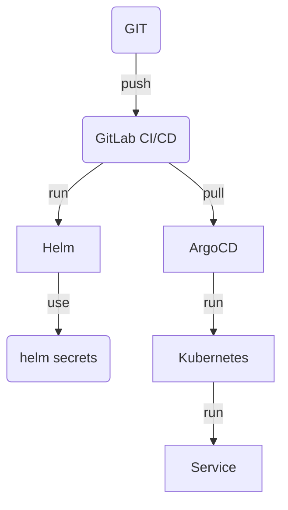

> Source: [docs/ADR/decisions/0013](https://github.com/shortlink-org/shortlink/blob/main/docs/ADR/decisions/0013-security.md)

## Context

Secret data needs protecting during deployment, and the deployment pipeline itself needs to be verifiable.

## Decision

### Secrets

[SOPS](https://github.com/mozilla/sops), with [helm-secrets](https://github.com/jkroepke/helm-secrets/wiki/Usage)
for Helm and the [ArgoCD integration](https://github.com/jkroepke/helm-secrets/blob/main/docs/ArgoCD%20Integration.md)
for GitOps.

### Cluster

[kubescape](https://github.com/kubescape/kubescape) scans the cluster for security issues.

### Supply chain

[SLSA](https://slsa.dev/), with `--sbom=true` and `--provenance=true` on Docker builds.

## Consequences

Encrypted files are committed rather than kept out of the repository — the `*.sops.yaml` and `*.sops.json` files in
the [[domain|Auth]] boundary (the Kratos secret, the courier config, and Oathkeeper's JWKS) are this decision in
practice.

Decryption becomes a deployment prerequisite: nothing can be applied without SOPS access.
