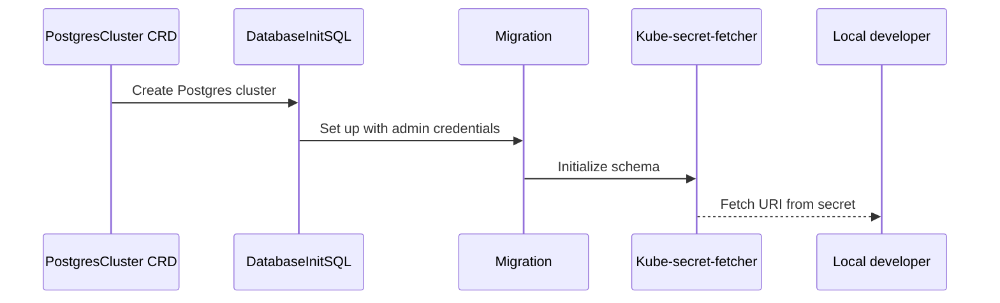

> Source: [docs/ADR/decisions/0026](https://github.com/shortlink-org/shortlink/blob/main/docs/ADR/decisions/0026-pattern-database-per-service.md)

## Context

Each microservice has its own requirements, which argues for its own database — the
[database per service](https://microservices.io/patterns/data/database-per-service.html) pattern.

## Decision

Implement database-per-service, using the CrunchyData Postgres operator. Each service gets its own Postgres cluster
through the `PostgresCluster` CRD.

## Consequences

Services stay loosely coupled and each has limited access to only its own data.

This is why [[container|link-postgres]] and [[container|kratos-postgres]] are separate clusters with separate
secrets (`shortlink-postgres-pguser-link`, `shortlink-postgres-pguser-kratos`) rather than schemas in one database —
and why the [[domain|Link]] read model has to be built from events instead of a join.

The ADR is candid about the cost: duplicated data, harder cross-service transactions and queries, and more databases
to operate.
