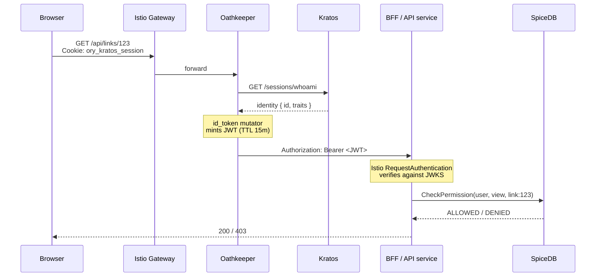

## Domain Overview

Auth is a **supporting domain**. It carries no shortlink business logic of its own — instead every other boundary
(Link, Metadata, BFF, Proxy) depends on it to establish caller identity and to check permissions before acting.

The boundary is built almost entirely on the [Ory](https://www.ory.sh/) stack plus
[SpiceDB](https://authzed.com/docs) (a Google Zanzibar implementation), with a thin Go service of our own that owns
the permission schema.

<NodeGraph mode="full" search="false" legend="false" />

## Systems

- [[system|identity-system]] — stores identities and sessions, renders the self-service flows (login, registration, recovery, verification, 2FA)
- [[system|access-proxy-system]] — validates the session cookie at the edge and mints a short-lived JWT for internal services
- [[system|permission-system]] — owns the relationship-based permission schema and answers `CheckPermission`

## Authentication vs Authorization

The two halves of this domain are deliberately separated and use different technology:

- **Authentication** — Ory Kratos owns identities and sessions. A browser holds an `ory_kratos_session` cookie.
  Cookies never travel inside the cluster; Oathkeeper exchanges them for a JWT.
- **Authorization** — SpiceDB stores relation tuples (`link:firstlink#writer@user:tom`) and evaluates permissions
  from them. There are no roles in a table; permission is derived from relationships.

## The Zero Trust request path

Every consuming service enforces this independently through Istio: a `RequestAuthentication` verifies the JWT against
Oathkeeper's JWKS endpoint (`http://oathkeeper-api.auth.svc.cluster.local:4456/.well-known/jwks.json`, issuer
`https://shortlink.best`) and an `AuthorizationPolicy` rejects anything without a valid request principal — except
`/live`, `/ready`, `/healthz` and `/metrics`.

## Key decisions

- [[adr|adr-auth-0001-zero-trust-authentication-flow]] — move session validation out of BFF into Oathkeeper at the edge
- [[adr|adr-auth-0002-permissions-with-spicedb]] — use SpiceDB instead of Ory Keto for permissions
- [[adr|adr-auth-0003-access-control-schema]] — the `user` / `anonymoususer` / `team` / `link` schema

## Business flows

- [[flow|AuthenticatedRequest]] — browser request travelling through the edge to a protected API
- [[flow|UserRegistration]] — new account created through the Kratos self-service registration flow
