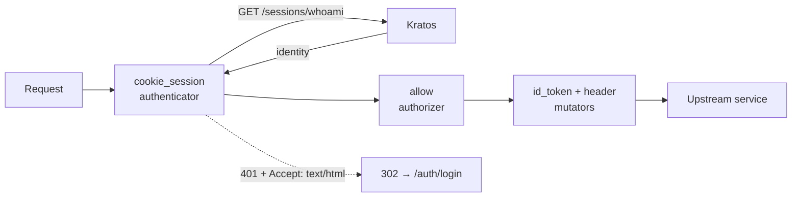

## Overview

Oathkeeper is the single place where a session cookie is exchanged for a token. Deployed from
`ops/Helm/oathkeeper` (Ory chart `0.61.1`), it serves the proxy on `:4455`, its API on `:4456` and Prometheus
metrics on `:9000`.

## Architecture diagram

<NodeGraph />

## Pipeline



### Authenticators

| Handler | Use |
|---------|-----|
| `cookie_session` | The real one. Calls `http://kratos-public.auth.svc.cluster.local/sessions/whoami`, takes the subject from `identity.id`, keeps the whole response as `@this` for the mutators. Only reacts to the `ory_kratos_session` cookie. |
| `anonymous` | Public routes — subject becomes `guest` |
| `noop` | Pass-through, used for the Kratos public API itself |

### Mutators

`id_token` signs the claims below with the RS256 key from the SOPS-encrypted `jwks.sops.json`, TTL 15 minutes,
issuer `https://shortlink.best`:

```json
{
  "sub": "{{ print .Subject }}",
  "email": "{{ print .Extra.identity.traits.email }}",
  "name": "{{ print .Extra.identity.traits.name }}",
  "identity_id": "{{ print .Extra.identity.id }}",
  "session_id": "{{ print .Extra.id }}",
  "metadata": {{ .Extra.identity.metadata_public | toJson }}
}
```

`header` additionally sets `X-User-ID` and `X-Email`.

## Access rules

Glob-matched, loaded from `file:///etc/rules/access-rules.json`:

| Rule | Match | Authenticator | Upstream |
|------|-------|---------------|----------|
| `api:bff-protected` | `https://shortlink.best/api/<**>` | `cookie_session` | `shortlink-link-bff:7070` |
| `kratos:public` | `https://shortlink.best/api/auth/<**>` | `noop` | `kratos-public` |
| `shop:bff` | `https://shop.shortlink.best/<**>` | `cookie_session` | `shortlink-shop-ui:3000` |
| `shop:django-admin` | `https://shop-admin.shortlink.best/admin<**>` | `cookie_session` | `shortlink-shop-admin:8000` |
| `temporal:web-ui` | `https://temporal.shortlink.best/<**>` | `cookie_session` | `temporal-web:8080` |

Rule ordering matters: `kratos:public` must win over `api:bff-protected` for `/api/auth/**`, otherwise the login
endpoints themselves would require a session.

## Errors

An unauthenticated request with `Accept: text/html` gets a `302` to `https://shortlink.best/auth/login`; anything
else gets verbose JSON. `leak_sensitive_values` is `false` in production.

## Operations

```bash
# readiness
curl -s http://oathkeeper-api:4456/health/ready

# which rules are actually loaded
curl -s http://oathkeeper-api:4456/rules

# regenerate the signing key set
oathkeeper credentials generate --alg RS256 > jwks.json
```

Oathkeeper is a single point of failure for every authenticated surface — it needs an HA deployment. Current Helm
values request `10m` CPU / `64Mi` and cap at `100m` / `128Mi`.
