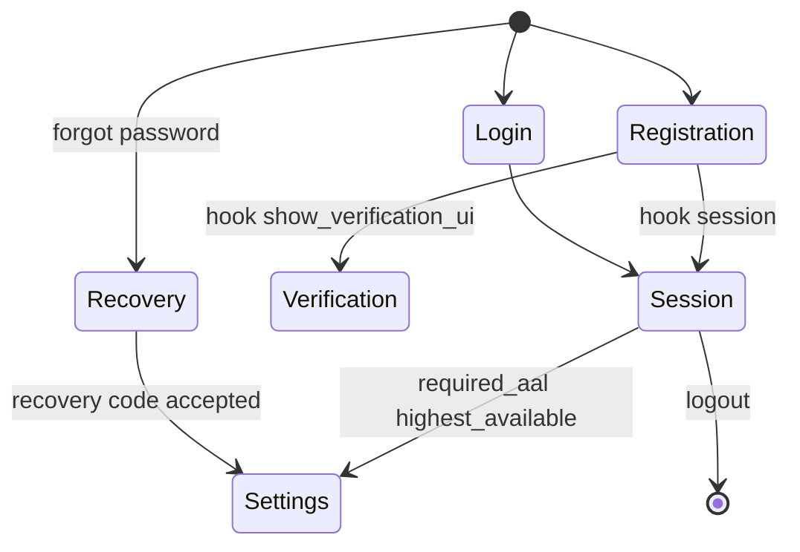

## Overview

Ory Kratos is deployed from `ops/Helm/kratos` (Ory chart `0.61.1`, wrapper chart `0.4.0`). It is the only component
that writes identity data, and the only component that can validate a session cookie.

Everything else in the boundary treats it as a dependency: [[service|AuthUI]] renders its flows,
[[service|Oathkeeper]] calls `/sessions/whoami` on every request.

## Architecture diagram

<NodeGraph />

## Configuration that matters

| Setting | Value |
|---------|-------|
| Public base URL | `https://shortlink.best/api/auth` |
| Session lifespan | `720h` (30 days) |
| Session cookie | domain `shortlink.best`, `SameSite=Lax` |
| Identity schema | `identity.schema.json` — email (required) + optional first/last name |
| Password hashing | Argon2 — 2 iterations, 128MB, parallelism 1 |
| Courier | SMTP, from `no-reply@shortlink.best` |
| Tracing | Jaeger → `grafana-tempo.grafana` |

## Self-service flows

Registration runs two after-hooks on the password path — `session` (log the user straight in) and
`show_verification_ui` — so a new account is usable immediately while email verification is still pending.

## Local development

`docker compose` brings Kratos up on `:4433` (public) and `:4434` (admin) against SQLite, with
[mailslurper](https://github.com/mailslurper) on `:4436`/`:4437` intercepting outbound mail. The local config points
the flows at `http://127.0.0.1:3000/next/...` and runs with `--dev --watch-courier`.
