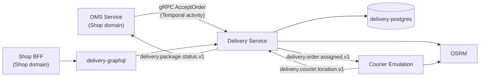

## Domain Overview

Delivery takes over where [[domain|Shop]] stops. It owns two aggregates — a **Package**, which is a state machine
from acceptance to delivery, and a **Courier**, which has a status, a capacity and a location — and the dispatch
algorithm that pairs them.

It ships from the same repository as Shop but is a separate boundary: separate aggregates, its own Postgres, its
own Temporal namespace, and its own domain-structure decision record.

The integration with Shop is asymmetric. Work arrives **synchronously**, as a gRPC `AcceptOrder` call made from a
Temporal activity on the Shop side. Everything the boundary reports back goes out **asynchronously**, as events on
Kafka. There is no consumer here for any `oms.*` topic.

<NodeGraph mode="full" search="false" legend="false" />

## Systems

- [[system|delivery-system]] — the package and courier aggregates, the gRPC API and the dispatch service
- [[system|courier-emulation-system]] — a simulated courier that drives the delivery path in test environments

## The delivery loop

## Events do not follow the platform naming standard here

This is the one place in the catalog where the code and
[[adr|adr-platform-0002-canonical-event-naming]] disagree, and the catalog documents the code.

Every event message in `delivery/src/domain/model/delivery/events/v1/events.proto` carries a comment naming it in
canonical per-event form — `delivery.package.accepted.v1`, `delivery.package.delivered.v1`, and so on. **Those
topics do not exist.** The publisher consolidates by entity lifecycle into four:

| Channel | Carries | Why separate |
|---------|---------|--------------|
| [[channel\|delivery.package.status.v1]] | all six package status events | one ordered stream per package |
| [[channel\|delivery.order.assigned.v1]] | PackageAssigned, again | JSON payload, kept for the emulator |
| [[channel\|delivery.courier.events.v1]] | CourierRegistered, CourierStatusChanged | low volume lifecycle |
| [[channel\|delivery.courier.location.v1]] | CourierLocationUpdated | high volume, different retention |

The consumer side confirms it: [[service|OMSService]] subscribes to `delivery.package.status.v1` and switches on an
`event_type` header, not to six separate topics.

So an event here is a *message type*, not a topic. Reading the proto comment as a topic name will send you looking
for a topic that was never created.

## Dispatch

Assignment is either manual (a courier id) or automatic. Automatic dispatch picks by Haversine distance from the
courier's last known location, filtered by status, capacity and work zone — see
[[adr|adr-delivery-0004-dispatching-and-geolocation]]. Location itself arrives over Kafka rather than an API call,
which is why [[event|CourierLocationUpdated]] has a channel to itself.

## Why Rust

The domain layer is Rust with `sea-orm` for persistence and `tonic` for gRPC — the only Rust service on the
platform. [[adr|adr-delivery-0003-domain-structure]] describes the model/services split it uses.

Like OMS, it publishes through a transactional outbox rather than writing to Kafka inside the aggregate
transaction — `delivery/migration/src/m20260311_000006_create_outbox_messages.rs`.

## Key decisions

- [[adr|adr-delivery-0003-domain-structure]] — aggregates, value objects and where domain services live
- [[adr|adr-delivery-0004-dispatching-and-geolocation]] — courier selection and how location is sourced
- [[adr|adr-courier-emulation-0003-osrm-routing]] — why routes come from a self-hosted [[system|osrm]]

## Business flows

- [[flow|DeliverPackage]] — accept, assign, pick up, deliver, and report back to the order
