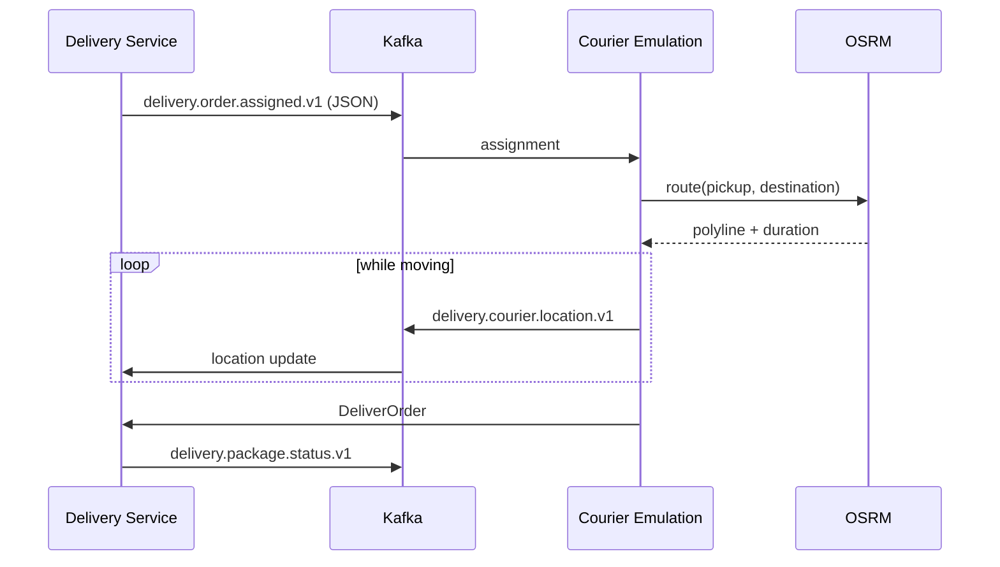

## Overview

There is no way to exercise the delivery path without a courier moving through a city. This system is that courier:
it takes assignments, walks an OSRM route, reports its location as it goes, and confirms delivery at the end.

It is separated from [[system|delivery-system]] on purpose. Everything in here is a test fixture, and a reader
looking at the production path should not have to work out which of the two services is real.

## Context Diagram

<ContextDiagram />

## Resource Diagram

<NodeGraph />

## The loop it closes

## Why assignment has its own topic

[[channel|delivery.order.assigned.v1]] carries the same fact as the package status stream, but as JSON rather than
protobuf, and only for this consumer. It is a compatibility affordance for the emulator, not a second source of
truth — the authoritative record of an assignment is [[event|PackageAssigned]] on
[[channel|delivery.package.status.v1]].
