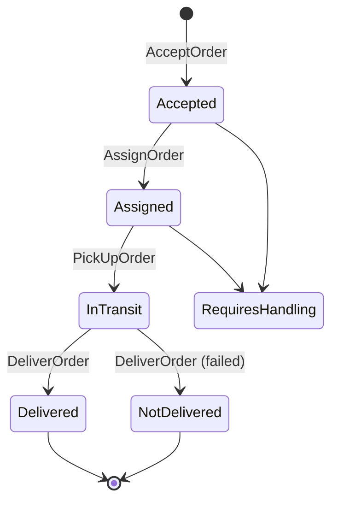

## Overview

[[service|DeliveryService]] is the whole of the boundary's logic: two aggregates, a state machine over each, a
dispatch service, and an outbox. [[service|DeliveryGraphQL]] adapts its gRPC into the federated graph so the Shop
storefront can render tracking. [[service|SupportService]] is a placeholder for customer service around a shipment.

## Context Diagram

<ContextDiagram />

## Resource Diagram

<NodeGraph />

## Package as a state machine

Each transition writes an event to the outbox in the same transaction as the aggregate
(`m20260311_000006_create_outbox_messages`), and all six land on one topic.

## Assignment

`AssignOrder` takes a `oneof`: either an explicit `courier_id`, or `auto_assign`. Automatic dispatch filters
couriers by status, capacity and work zone, then sorts by Haversine distance from their last known location —
[[adr|adr-delivery-0004-dispatching-and-geolocation]].

Location does not come from an API call. It arrives on [[channel|delivery.courier.location.v1]], which is why
`UpdateCourierLocation` exists as a command with no matching RPC on the gRPC service.

## Tracking

`GetOrderTracking` and `SubscribeOrderTracking` are keyed by the **OMS order id**, not the package id — they exist
for a caller in the other boundary who has never seen a package. The subscribe variant is the only server-streaming
RPC in the catalog.

## Two things the API does not expose

Both are real domain concepts with no RPC on `DeliveryService`:

- [[query|GetPackagePool]] — defined in `queries/v1/queries.proto`, has a use-case README, reachable only in-process
- [[command|UpdateCourierLocation]] — driven from Kafka instead
