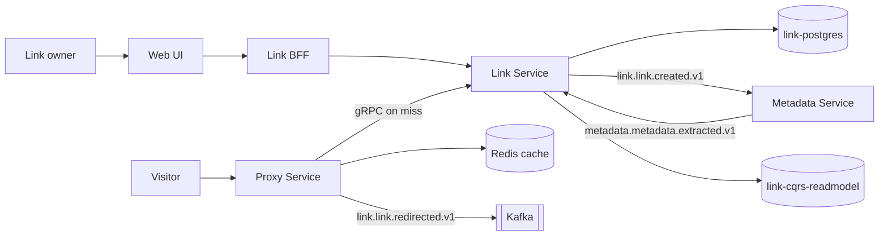

## Domain Overview

Link is the domain the product is named after. Everything in it turns on one asymmetry: links are **written rarely
and read constantly**, and the two paths have almost nothing in common.

That split runs through the whole design — separate systems, separate stores, separate languages, separate security
posture.

<NodeGraph mode="full" search="false" legend="false" />

## Systems

- [[system|web-system]] — the Next.js application people use to create and manage links.
- [[system|link-management-system]] — owns the link aggregate and the public API over it. Authenticated, low volume,
  strongly consistent.
- [[system|redirect-system]] — resolves a hash and redirects. Anonymous, high volume, cache-first.
- [[system|metadata-system]] — enriches links asynchronously from the pages they point at.

## The write path and the read path

The two halves meet at exactly one point: the proxy calls the link service on a cache miss. Nothing else crosses.

## Messaging

Five events, three commands and two queries, all protobuf over Kafka. Topic names follow the platform standard in
[[adr|adr-platform-0002-canonical-event-naming]] and are derived from a shared namer rather than written by hand,
which is why `link.link.created.v1` reads identically in the Go publisher and the TypeScript consumer.

## Consistency

Worth being explicit about, because three different guarantees coexist here:

| Path | Guarantee |
|------|-----------|
| Create / update / delete a link | Strongly consistent — one writer, one Postgres |
| Metadata on a link | Eventually consistent — arrives when the target page has been fetched |
| Anonymous redirect | Stale up to the cache TTL — nothing invalidates on update or delete |
| Authenticated redirect | Always current — the cache is bypassed whenever a user id is present |

## Key decisions

- [[adr|adr-link-0004-domain-link]] — no URL length limit; a 6-character hash over a 62-symbol alphabet
- [[adr|adr-link-0002-store-provider]] — which of the eight store drivers are actually supported
- [[adr|adr-proxy-0007-redis-caching]] — positive and negative caching on the redirect path
- [[adr|adr-proxy-0005-event-driven-architecture]] — events dispatched off the response path
- [[adr|adr-proxy-0004-anti-corruption-layer]] — the proxy's domain never sees the link service's protobuf

## Relationship to Auth

Link depends on [[domain|Auth]] twice over, for two different things, and
[[adr|adr-platform-0042-link-privacy-control]] is what separates them:

| Operation | Mechanism | Owned by |
|-----------|-----------|----------|
| List, Create, Update, Delete, team RBAC | SpiceDB relations | Auth |
| GET / redirect | email allowlist on the aggregate, caller's email read from the Kratos Admin API | Link |

So the redirect path never touches SpiceDB, and a public link is served without consulting Kratos either. The
[[entity|Link]] aggregate holds the allowlist; the SpiceDB `link` definition lives in
[[system|permission-system]].
