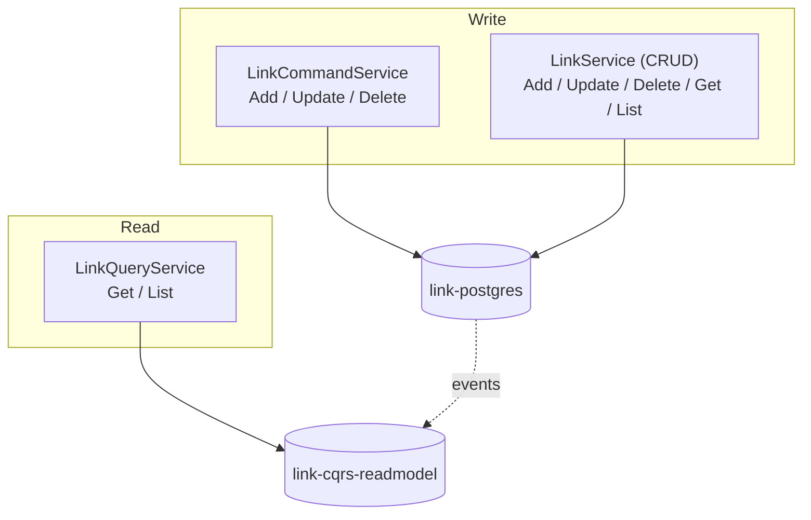

## Overview

The write side of the domain. [[service|LinkBFF]] exposes REST to browsers, [[service|LinkService]] holds the
aggregate and the gRPC contracts, and the two Postgres containers separate the source of truth from the projection
that reads join against.

## Context Diagram

<ContextDiagram />

## Resource Diagram

<NodeGraph />

## Two API styles over one aggregate

The service carries both a plain CRUD API and a CQRS command/query pair. They are alternatives, not layers:

Metadata only ever appears on the query side. A client that reads through the CRUD API gets the link and nothing
else; the enriched view is exclusive to `LinkQueryService`.

## Authorization

Two mechanisms govern a link, split by operation rather than duplicated
([[adr|adr-platform-0042-link-privacy-control]]):

- **List, Create, Update, Delete and team RBAC** go through [[system|permission-system]] in the [[domain|Auth]]
  domain — the SpiceDB `link` definition (`reader`, `writer`, `linkteam`,
  `view = reader + writer + linkteam->view_all_links`) describes links but is owned there.
- **GET and redirect** use the email allowlist on the aggregate itself, resolving the caller's email through the
  Kratos Admin API. SpiceDB is not consulted.

Both paths are wired into the service: its DI graph takes a SpiceDB permission client *and* a Kratos client
side by side.
