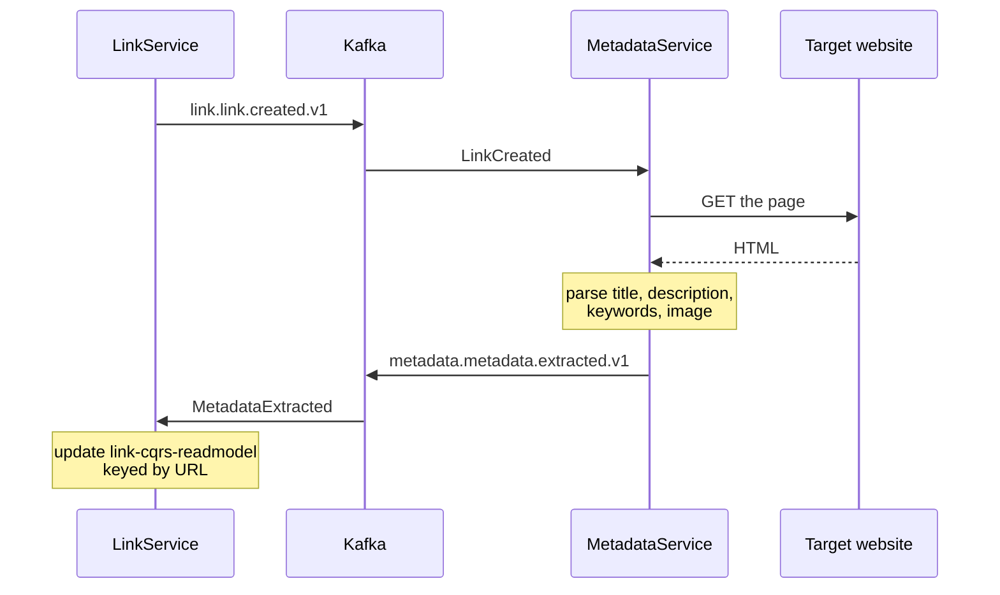

## Overview

A single service whose entire job is to keep slow, unreliable work off the link creation path. It wakes on
[[event|LinkCreated]], fetches whatever the URL points at, and reports back with [[event|MetadataExtracted]].

## Context Diagram

<ContextDiagram />

## Resource Diagram

<NodeGraph />

## The enrichment loop

The loop closes back into the same service it started from. That is what makes the read model eventually consistent
rather than the link record itself — the write store is never touched by enrichment.

## What can go wrong

The remote site is entirely outside the platform's control: it can be slow, gone, or hostile. Nothing here is on a
user's critical path, so a failure means a link without metadata, not a failed operation. The trade is that "how long
until a new link has a preview" is not a number this system alone can promise.
