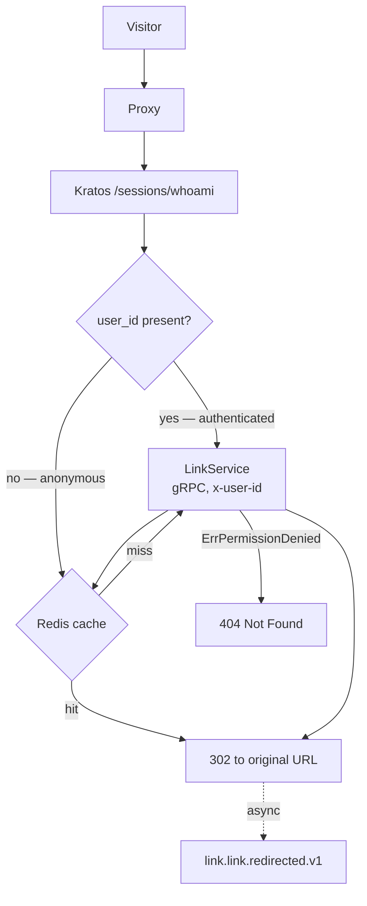

## Overview

Every visit to a short link lands here. The proxy takes the hash, resolves it to the original URL, and issues the
redirect — then publishes [[event|LinkRedirected]] out of band.

Redirects do not require a JWT — the link chart grants the `shortlink-link-proxy` service account mTLS access to
[[service|LinkService]] without one. But the proxy is not identity-blind: it reads the Kratos session on every
request and forwards `x-user-id` in gRPC metadata, empty when there is no session.

It never decides anything with that identity. Authorization for private links happens entirely inside
[[service|LinkService]] — see [[adr|adr-platform-0042-link-privacy-control]].

## Architecture diagram

<NodeGraph />

<MessageTable format="all" limit={4} />

## Request path

Caching is two-sided ([[adr|adr-proxy-0007-redis-caching]]): found links are cached for ~1 hour, *misses* for ~5
minutes. Negative caching is the interesting half — it stops a flood of requests for a hash that does not exist from
reaching [[service|LinkService]] at all. If Redis is down the proxy degrades gracefully and calls through.

> [!NOTE]
> The cache is **skipped entirely** when a `user_id` is present. `LinkServiceRepository.findByHash` branches before
> the cache lookup, with an explicit `TODO` about a user-aware cache key. Every redirect by a logged-in visitor
> therefore costs a gRPC call — the cache accelerates anonymous traffic only.

## Architecture

The service is a clean-architecture codebase, and the boundaries are enforced rather than aspirational:

- [[adr|adr-proxy-0004-anti-corruption-layer]] — `LinkServiceACL` maps protobuf to domain entities, so the domain
  layer never imports generated types
- [[adr|adr-proxy-0005-event-driven-architecture]] — events are dispatched after the redirect through a
  notification-pattern `EventDispatcher`
- [[adr|adr-proxy-0007-redis-caching]] — positive and negative caching in front of the gRPC call

Production also runs under the Node.js Permissions API (`permissions.json`) — the process is restricted at runtime,
not only by deployment policy.

## Runtime

| | |
|---|---|
| Image | `registry.gitlab.com/shortlink-org/shortlink/proxy` |
| Port | `3020` |
| Link service | `shortlink-link-link.shortlink-link:50051` |
| Broker | Kafka — `shortlink-kafka-bootstrap.kafka:9092` |
