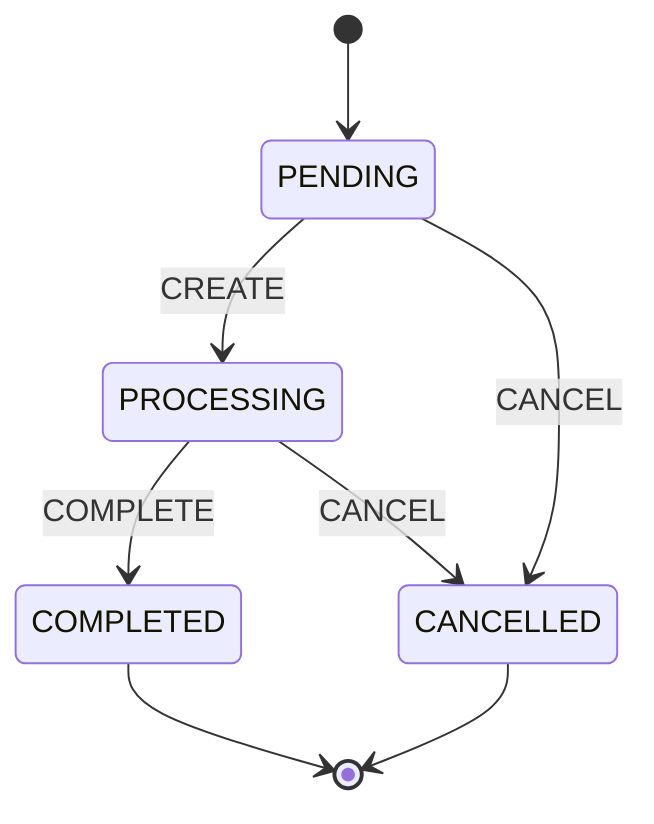

## Overview

The central aggregate of [[system|order-system]], owned by [[service|OMSService]] and stored in
[[container|oms-postgres]].

## Entity Properties

<EntityPropertiesTable />

## Status is a state machine, not a column

The protobuf separates **state** from **action**: `OrderStatus` is the state, `OrderTransitionEvent` is what moves
it.

A completed order is terminal — which is what makes [[event|OrderCompleted]] safe to fold into the
[[container|oms-redis-leaderboard]] ranking.

## Delivery is referenced, never owned

An order that ships carries a `package_id` and a `delivery_status`, and nothing else about the shipment. The
[[entity|Package]] itself is an aggregate in the [[domain|Delivery]] boundary with its own lifecycle, its own
database and its own courier.

The order learns about it by consuming delivery status and re-publishing it as its own event, so that a consumer of
the order never has to subscribe to a delivery topic.

## Why the version matters

`aggregate_version` rides on every event the order publishes. Two mechanisms depend on it:

- **Stale delivery updates are dropped.** Delivery status arrives at-least-once and out of order; the handler
  compares against the current state before applying.
- **The leaderboard deduplicates on it.** The processed-event key in Redis is built from the order id *and* this
  version, so a redelivered message is ignored while a genuine later change still counts.
