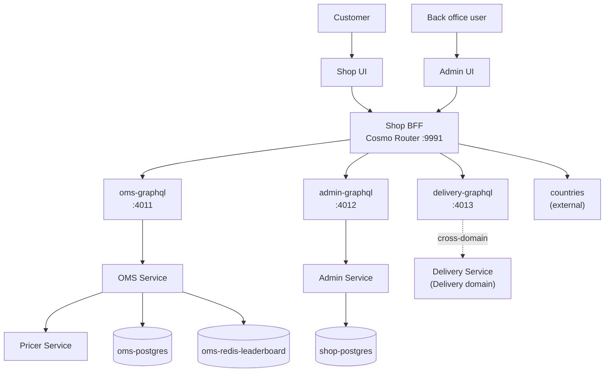

## Domain Overview

Shop is where a customer picks goods, fills a cart and places an order. It stops at the moment the order needs to
physically move — that is [[domain|Delivery]], a separate boundary.

The domain is deliberately polyglot. The back office is Django because it is a CRUD admin and Django is very good
at CRUD admins; the order engine is Go with Temporal because orders are long-lived processes; pricing is Go with a
Rego policy engine because discount rules change more often than code should.

<NodeGraph mode="full" search="false" legend="false" />

## Systems

- [[system|catalog-system]] — goods and office reference data, and the back office that edits them
- [[system|order-system]] — the Cart and Order aggregates, their Temporal workflows, and pricing
- [[system|storefront-system]] — the federated graph and the customer-facing storefront

## The shape of a request

Nothing talks to the order engine directly. Every read and write arrives through one federated GraphQL endpoint,
which fans out to typed gRPC subgraphs:

The subgraphs are adapters and nothing more. `oms-graphql` and `delivery-graphql` translate GraphQL to gRPC;
`admin-graphql` translates GraphQL to the Django REST API. None of them holds business logic or a datastore.

## Events

Shop publishes one topic per event, and the topic is never written by hand: the bus derives it from the event value
through `namer.EventName(evt)` (`go-sdk/cqrs/bus/event_bus.go:130`).

That makes the names *consistent*, but only three of the ten match
[[adr|adr-platform-0002-canonical-event-naming]]:

| Event | Actual topic | Canonical? |
|-------|--------------|------------|
| [[event\|OrderCreated]] | `oms.order.created.v1` | yes |
| [[event\|OrderCancelled]] | `oms.order.cancelled.v1` | yes |
| [[event\|OrderCompleted]] | `oms.order.completed.v1` | yes |
| [[event\|OrderDeliveryRequested]] | `oms.order.delivery_requested_event.v1` | no — `_event` suffix |
| [[event\|OrderDeliveryStatusUpdated]] | `oms.order.delivery_status_updated_event.v1` | no |
| [[event\|OrderDeliveryCompleted]] | `oms.order.delivery_completed_event.v1` | no |
| [[event\|OrderDeliveryFailed]] | `oms.order.delivery_failed_event.v1` | no |
| [[event\|CartItemAdded]] | `oms.oms.item_added_event.v1` | no — aggregate lost |
| [[event\|CartItemRemoved]] | `oms.oms.item_removed_event.v1` | no |
| [[event\|CartReset]] | `oms.oms.reset_event.v1` | no |

Two mechanical causes, both in the namer:

- **The `_event` suffix leaks.** The namer takes the protobuf message name and strips only the aggregate prefix, so
  `OrderCreated` becomes `created` but `OrderDeliveryRequestedEvent` becomes `delivery_requested_event`.
- **The cart loses its aggregate.** The namer reads the aggregate from the protobuf package. Cart events are plain
  Go structs, not protobuf messages, so there is no package to read and it falls back to the service name — giving
  `oms.oms.` instead of `oms.cart.`.

> [!WARNING]
> Do not take a topic name from the source comments. `event_type.go` and the `EventTopic` enum in
> `domain/cart/v1/event.proto` both state the canonical names, and the bus consults neither. Every channel page in
> this domain carries the address that is actually published to.

Two further details differ from [[domain|Link]]:

- **Payloads are JSON, not Protobuf.** The protobuf files define the shape, but the bus marshals with
  `NewJSONMarshaler`. Link uses `ProtoMarshaler`.
- **Publishing goes through a transactional outbox in Postgres**, not straight to Kafka — the event and the
  aggregate commit together, and a forwarder moves it on. See [[adr|adr-oms-0005-reliable-domain-events-outbox]].

## Where the boundary to Delivery is

The crossing is **asymmetric**, and not in the direction the event names suggest.

**Outbound is a synchronous gRPC call.** When an order needs shipping, a Temporal activity in
[[service|OMSService]] calls `AcceptOrder` on [[service|DeliveryService]] and waits for the package id
(`oms/internal/workers/order/activities/activities.go`). Durability comes from the workflow, not from a broker:
the activity heartbeats, retries on transient failures, and classifies `InvalidArgument`, `AlreadyExists` and
`PermissionDenied` as non-retryable rather than looping forever.

**Inbound is Kafka.** Delivery reports status on its own topic, and OMS turns what it hears into its *own* events —
[[event|OrderDeliveryStatusUpdated]], [[event|OrderDeliveryCompleted]], [[event|OrderDeliveryFailed]] — so that
consumers of the order aggregate never have to subscribe to a delivery topic to learn what happened to an order.

> [!NOTE]
> The protobuf comments on those three events say they are "received from delivery service". That is wrong: they
> are published *by* OMS after it consumes a delivery status change. The event a consumer sees on
> `oms.order.delivery_completed_event.v1` was written by OMS, not by Delivery.

[[event|OrderDeliveryRequested]] reads like the trigger for all this and is not. It is published to
`oms.order.delivery_requested_event.v1`, where **nothing consumes it** — the actual request is the gRPC call above. It is
a notification for anyone who wants to observe that delivery was requested, not the mechanism.

The second synchronous crossing is the graph: [[service|ShopBFF]] federates [[service|DeliveryGraphQL]] so a
customer can see tracking next to their order.

## Key decisions

- [[adr|adr-shop-0005-oathkeeper-auth-shop]] — how identity arrives from the [[domain|Auth]] boundary
- [[adr|adr-shop-0006-goods-leaderboard-read-model]] — the Kafka-driven Redis read model behind the leaderboard
- [[adr|adr-oms-0003-temporal]] — durable execution for carts and orders
- [[adr|adr-oms-0005-reliable-domain-events-outbox]] — why events go through Postgres before Kafka

## Business flows

- [[flow|Checkout]] — cart to order to a delivery request
