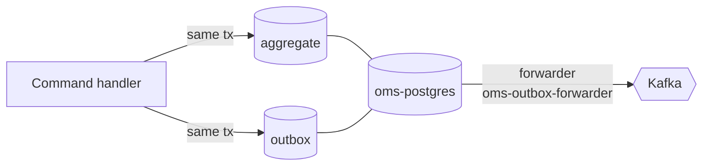

## Overview

The engine of the domain. [[service|OMSService]] owns [[entity|Cart]] and [[entity|Order]], runs them as Temporal
workflows, and is the only publisher of Shop events. [[service|PricerService]] answers one question — what does this
cart cost — from policy rather than code. [[service|OMSGraphQL]] adapts the gRPC surface into the federated graph.

## Context Diagram

<ContextDiagram />

## Resource Diagram

<NodeGraph />

## Aggregates as workflows

A cart is not a row that gets updated; it is a running Temporal workflow mutated by signals — ADD, REMOVE, RESET.
An order is a workflow that moves through create, complete and cancel. [[adr|adr-oms-0003-temporal]] explains the
choice; [[adr|adr-oms-0004-hexagonal-architecture-with-temporal]] constrains how far Temporal is allowed to reach
into the domain layer.

## Events leave through Postgres, not Kafka

The service never publishes to Kafka inside a business transaction. Events are written to an outbox table in
[[container|oms-postgres]] in the same transaction as the aggregate, and a forwarder moves them on to Kafka
afterwards:

This is what makes "the order was saved but the event was lost" impossible. See
[[adr|adr-oms-0005-reliable-domain-events-outbox]].

Topic names are not written by hand anywhere. The bus builds them from the event type, so
[[event|OrderCreated]] can only ever land on `oms.order.created.v1`.

## Pricing is a policy, not a code path

[[service|PricerService]] evaluates Rego. Adding a discount rule is a policy change, not a deploy of the order
engine. The integration is deliberately weak: if pricer is unreachable the order engine logs a warning and carries
on without pricing rather than failing the request.

## The leaderboard is a projection

[[container|oms-redis-leaderboard]] ranks goods by completed orders. It is fed by consuming
[[event|OrderCompleted]] off Kafka — the order engine subscribing to its own event — and it can be rebuilt from the
stream. See [[adr|adr-shop-0006-goods-leaderboard-read-model]].
