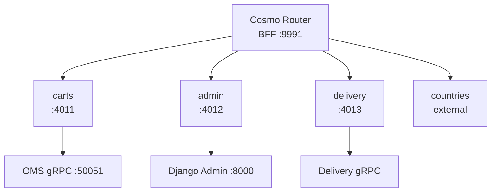

## Overview

Everything a browser touches arrives here on `:9991`. The router composes four subgraphs into a single schema so
that [[service|ShopUI]] and [[service|AdminUI]] make one request instead of four.

## Architecture diagram

<NodeGraph />

## Composition

| Subgraph | Transport | Behind it | Domain |
|----------|-----------|-----------|--------|
| carts | Connect gRPC | [[service\|OMSGraphQL]] → [[service\|OMSService]] | Shop |
| admin | Connect gRPC | [[service\|AdminGraphQL]] → [[service\|AdminService]] | Shop |
| delivery | Connect gRPC | [[service\|DeliveryGraphQL]] → [[service\|DeliveryService]] | **Delivery** |
| countries | HTTP introspection | `countries.trevorblades.com` | external |

Composition is not dynamic: `wgc router compose` reads `bff/graph.yaml` and generates an execution config from
schema, proto and mapping files committed in each subgraph.

> [!NOTE]
> The commands and queries listed on this page pass **through** the router, they are not issued by it. Every one of
> them is executed against its owning service by the subgraph in front of it — the router never opens a connection
> to [[service|OMSService]] or [[service|DeliveryService]] itself.

## The one synchronous boundary crossing

The `delivery` subgraph reaches into [[domain|Delivery]]. It is deliberate and it is the only one: a customer
looking at an order gets its tracking in the same response, without [[domain|Shop]] ever loading a
[[entity|Package]].

Every other interaction between the two domains is asynchronous, over Kafka.

## Authentication happens upstream

The router does not validate sessions or mint tokens. Identity is already established by
[[service|Oathkeeper]] at the edge and arrives as a JWT — see [[adr|adr-shop-0005-oathkeeper-auth-shop]].

## Stateless

No database, no cache, no events. If it is down nothing is lost, but nothing is reachable either — it is the single
front door.
