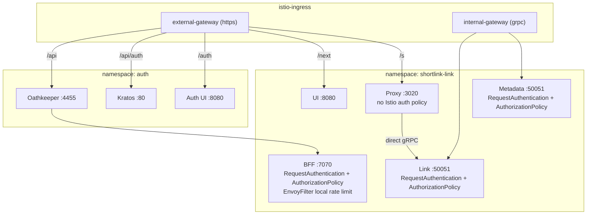

## Overview

Every path in this catalog crosses this system. It is not a service anyone wrote — it is Envoy, configured by the
Helm charts of the services behind it, and it is where authentication, rate limiting and network isolation are
actually enforced.

Routing uses the **Gateway API** (`HTTPRoute` / `GRPCRoute`), not Istio `VirtualService`. Each service chart owns the
route to itself, so the routing table is assembled from the charts rather than declared in one place.

## Context Diagram

<ContextDiagram />

## The two gateways

| Gateway | Namespace | Section | Carries |
|---------|-----------|---------|---------|
| `external-gateway` | `istio-ingress` | `https` | public traffic for `shortlink.best` |
| `internal-gateway` | `istio-ingress` | `grpc` | in-cluster gRPC between services |

Neither gateway is defined in the repositories this catalog reads — the charts only reference them by `parentRefs`.

## Public routing table

Everything below is on the host `shortlink.best`, attached to `external-gateway`:

| Path prefix | Rewrite | Backend | Namespace | Owned by |
|-------------|---------|---------|-----------|----------|
| `/api/auth` | → `/` | `kratos-public:80` | `auth` | kratos chart |
| `/api` | — | `oathkeeper-proxy:4455` | `auth` | **bff** chart |
| `/auth` | — | `auth-ui:8080` | `auth` | auth-ui chart |
| `/next` | → `/` | `shortlink-link-ui:8080` | `shortlink-link` | ui chart |
| `/s` | → `/s` | `shortlink-link-proxy:3020` | `shortlink-link` | proxy chart |

Two things this table settles that prose about "the edge" tends to blur:

1. **The BFF's own chart routes `/api` to Oathkeeper**, in a different namespace. The Zero Trust chain from
   [[adr|adr-auth-0001-zero-trust-authentication-flow]] is expressed by the service being protected, not by the
   proxy doing the protecting.
2. **The redirect path is `/s/<hash>`** — a short link is `https://shortlink.best/s/<hash>`, matched by prefix and
   passed through to the proxy.

The services behind these routes are [[service|WebUI]] at `/next`, [[service|ProxyService]] at `/s`,
[[service|LinkBFF]] behind Oathkeeper at `/api`, and the [[domain|Auth]] pair at `/auth` and `/api/auth`.

### Cross-namespace references

A route may only point at a Service in another namespace if that namespace grants it. The Oathkeeper chart ships
three `ReferenceGrant`s in `auth`, permitting `HTTPRoute`s from `shortlink-link`, `temporal` and `shortlink-shop` to
reference `oathkeeper-proxy`.

### Overlapping prefixes

`/api/auth` and `/api` both match a request to a Kratos endpoint. Gateway API resolves overlapping prefixes by
specificity, so the longer one wins: Kratos' public API reaches `kratos-public` **directly**, while everything else
under `/api` goes through Oathkeeper.

The self-service flows therefore stay reachable without a session — which is what makes login possible at all — and
Oathkeeper's matching `kratos:public` rule (`noop` authenticator and mutator) expresses the same intent one layer
in.

## Policies attached to workloads



### RequestAuthentication and AuthorizationPolicy

`bff`, `link` and `metadata` each deploy the same pair:

- **`RequestAuthentication`** — issuer `https://shortlink.best`, JWKS from
  `http://oathkeeper-api.auth.svc.cluster.local:4456/.well-known/jwks.json`, forwarding the original token and
  copying `sub` → `x-user-id` and `email` → `x-user-email`
- **`AuthorizationPolicy`** — `ALLOW`, requiring `requestPrincipals: ["*"]`, with carve-outs for
  `/live`, `/ready`, `/healthz`, `/metrics` and `/grpc.health.v1.Health/*`

The link service adds one more rule: requests from the
`cluster.local/ns/shortlink-link/sa/shortlink-link-proxy` principal are allowed over mTLS without a JWT.

**[[service|ProxyService]] deploys neither.** It has no `request-authentication.yaml` and no
`authorization-policy.yaml` in its chart at all — it is the only documented service with no Istio-level auth,
which is what makes anonymous redirects possible.

### Rate limiting

The BFF carries an `EnvoyFilter` inserting Envoy's `local_ratelimit` before the router on inbound port `7070`:

| | |
|---|---|
| Bucket | 200 tokens, refilled 200 per `1s` |
| Enabled / enforced | 100% |
| Marker | responses carry `x-rate-limited: true` |

It is *local* — per proxy instance, not a shared quota across replicas.

A `WasmPlugin` (`oci://registry.gitlab.com/shortlink-org/shortlink/istio-plugin-shortlink:0.18.3`) is also defined
for the BFF, but `istio.plugin.enabled` is `false`.

### Egress is an allowlist

The shared `common` chart installs a `Sidecar` named `default` restricting what any workload in the namespace may
reach:

```yaml
egress:
  - hosts:
      - "./*"                # own namespace
      - "istio-system/*"
      - "istio-ingress/*"
      - "grafana/*"
      - "kafka/*"
      - "spicedb-operator/*"
```

Anything a workload needs outside that set has to be added to the `Sidecar`, so the list doubles as a statement of
which namespaces a service is expected to talk to.

`NetworkPolicy` is templated but disabled (`networkPolicy.enabled: false`) — isolation is the mesh's job here, not
the CNI's.

### Telemetry

A cluster-wide `Telemetry` resource turns on Envoy access logging for all workloads, with no selector.

## Service-to-service calls

Two different conventions coexist, and the difference is deliberate:

| Caller | Target | How |
|--------|--------|-----|
| [[service|LinkService]] | other services | through `internal-gateway-istio.istio-ingress` with TLS and a mounted CA |
| [[service|ProxyService]] | [[service|LinkService]] | **directly** at `shortlink-link-link.shortlink-link:50051` |

The proxy skips the internal gateway on the hot path — one hop fewer on the platform's highest-volume call.

> [!NOTE]
> The `GRPCRoute` for the link service exposes only `infrastructure.rpc.link.v1.LinkService` (plus gRPC reflection).
> `LinkCommandService` and `LinkQueryService` — the CQRS pair — are not routed through the internal gateway, so
> whatever reaches them does so by another path.
